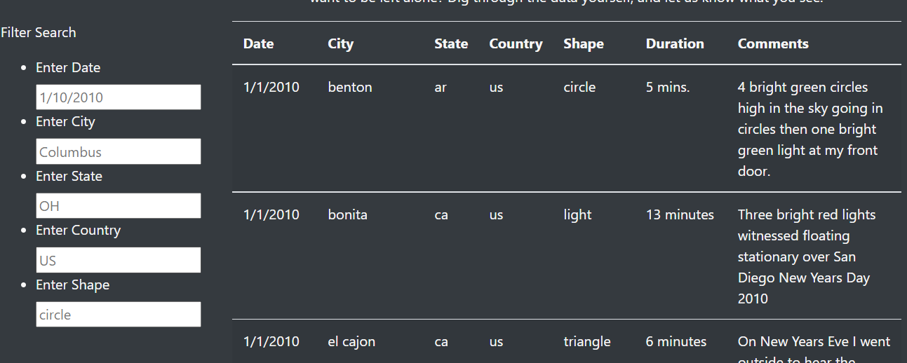

# UFOs
## Overview
The purpose of the project was to design an interface to access and identify trends in UFO data. This project used a JavaScript app script to access UFO data from another JavaScript file and display it in an HTML page. Filters were added to create a dynamic table. A CSS file and Bootstrap were used to format the page.

## Results
The webpage automatically displays all the records from the JSON file.

.

Filters can be entered into the fields to view only relevant records. For example, entering a specific date will return only results from that date. After entering the filter into the field, results will update upon pressing tab or enter or simply clicking outside of the search field. Filters are case and spelling sensitive, and must be entered in their entirety to return applicable results. 

.

Entering a city into the city field or a state abbreviation into the state field will also narrow the results.

.

We can use multiple filters at once. 

.

CA is a potential filter for either the state or the country field. 

.

Instead of filtering by location or date, we can filter for the shape of the UFO of record. 

.

## Summary
This new design still does not allow us to search for keywords within the comments or filter by the duration. The results are displayed, but an improvement could show the count of results and the number of results with various similarities. Another improvement would be to eliminate the case sensitivity of the filters. We could also eliminate the requirement for exact match so that a partial spelling would also return the results. 
